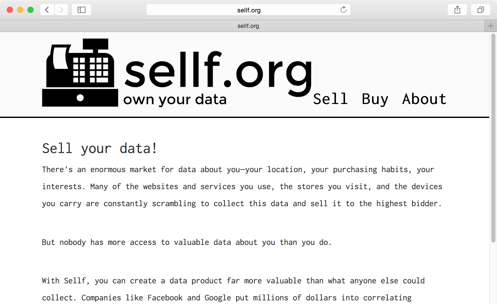

# Andrew Monks' Installation Work // 2015

[toc]

## Stereo

Head-mounted displays like the [Oculus Rift](https://www.oculus.com/) are trending super hard right now, and they were the first direction I explored this year. I made a [Google Cardboard](https://www.google.com/get/cardboard/) and set to work.

### Initial Head-Mounted-Display-Based Ideas

I'm interested in the unique power of stereoscopic head-mounted displays to completely replace what we perceive, especially to create visual input which would be impossible otherwise. For example, what would it be like to [see the world upside-down ](http://cl.ly/ZiLS).

This almost sounds obvious, but in time, I realized that the most fundamentally new experience that stereoscopic displays can provide is showing different images to each eye. In the real world, no matter what kind of wonderfully transformative things you see, you'll always see them through two cameras facing the same direction from a few inches apart. But what if one of your eyes was somewhere else?

#### Water

In this [installation ](http://cl.ly/ZhtF), the viewer would wear a head-mounted display with a front-facing camera. Software would detect the walls of the room in each frame of that camera feed, and create two altered versions: in each, the walls would be replaced by video of a different body of water. Each altered image would then be displayed to one of the viewer's eyes.

### Stereoscopic Splitting

In order to test this uncharted territory as thoroughly as possible, I decided to make a configurable tool for showing different animation to different eyes. Starting as simply as alternating solid black and white light, and moving through objects rotating in opposite directions and realtime video filtered in different colors.

I quickly outgrew the [first tool](http://ss.cx/~ajm/s/config.html) I made for these tests, and I've been adapting and growing it into a useful product in its own right: a fully-customizable framework for running visual code in the browser, with support for live-coding and collaboration. That project is currently undergoing [rapid development](http://github.com/amonks/vjjs).

Clearly this wasn't going to be presentable any time soon, so I needed a new project.

## New Major Theme: Surveillance

### Literal Surveillance 2-room Proposal

For my installation in the two rooms on 13, I would like to create a surveillance center  in the larger room using live camera footage and data from the smaller room.

I'll use several raspberry pi with cameras, each mounted directly on the walls or ceiling, with wires exposed. Using another raspberry pi with an attached kinect, I'll also take a depth camera feed, and with another raspberry pi with a large wifi antenna I'll run a `tcpdump`. all of these raspberry pi will connect via Ethernet to a wireless router, and will send the information to a matching router in the larger room. This router will connect to two laptops  in opposite corners of the floor of the room, placed as if casually in use. The laptops will each be placed next to a projector, also on the floor  The laptops will be projecting and displaying a different combination of feeds from the other room.

#### Materials

*   x 4 raspberry pi
*   4 picam
*   6 Ethernet cables
*   x large antenna
*   x kinect
*   2 routers
*   2 power strips
*   2 projectors

### Sellf

[sellf.org](http://sellf.org)

#### Statement

##### Sellf.org

`sellf.org` is a company that explores the ramifications of the commodification of personal data, by operating a free for-sale-by-owner data market. The premise: "Who's better equipped to sell your data than you are?"

By revealing the market value of consumer data, `sellf.org` creates and investigates a world where consumerism can be self supporting. Can you make a living by publishing how you spend that living?

More importantly, `sellf.org` seeks to attack the current form of the relationship between Big Data Collection and the public.

#### For sellers

There's an enormous market for data about you—your location, your purchasing habits, your interests. Many of the websites and services you use, the stores you visit, and the devices you carry are constantly scrambling to collect this data and sell it to the highest bidder.

But nobody has more access to valuable data about you than you do.

With Sellf, you can create a data product far more valuable than what anyone else could collect. Companies like Facebook and Google put millions of dollars into correlating datasets together, but you can sell all of your data as a single package. Google and Facebook can't compete.

#### For buyers

Data mining allows us to advertise more cheaply and effectively than ever thought possible. Don't just target demographics, target conditions: `just stopped at atm`, `good mood`, `hungry`, `drunk`.

By collecting all of a consumer's data from every source with consent, `sellf.org` offers a revolutionary data resolution, enabling you to sell many times more for every advertising dollar.

##### What happens to data collected online anyway?

I honestly expected to be able to go online and find some page where I could buy a huge dataset from facebook or something. I haven't been able to find anything of the kind. Data collectors monetize their data through ad platforms.

##### thoughts

I'm not sure who to address on the `buy` page.

###### option 1

I could position sellf.org as a traditional marketing data sales company, selling huge datasets to corporate interests.

This approach most directly engages with the current personal data market. On the other hand, as far as I've turned up, most of the huge data collectors (amazon, google, facebook) sell data indirectly via an advertising platform rather than as a dataset.

A person has many datagrams which are (can be?) sold together. A buyer makes an order like "the cheapest hundred people who spend more than 100k per year and offer location and purchase data with >90% completeness", and it's filled based on how sellers set their prices.

###### option 2

On the other hand, it would be interesting to create a data market targeted more towards artists + hobbyists rather than marketing departments. Allowing people to submit arbitrary types/sets of data will help the ecosystem grow autonomously.

#### Installation: Sellf.org Promotional Seminar

http://sellf.org tactically interjects itself into the online space to ask people critical questions about surveillance and create much-needed discourse. The *Sellf.org Promotional Seminar* brings that same interjection to the physical space.

In the installation, one or two representatives from Sellf.org set up a display in a public space, and give a presentation informing the public about data surveillance and soliciting them to start harvesting and selling their own data.

By engaging the public through a commercial, rather than an art context, the company seeks to surface the conversation about personal commoditization.

It forces people to consider questions personally that an art-framed piece couldn't ('what am I getting paid for?' 'What will happen if I sell this?' 'How much will I sell my data for?' 'What is my privacy worth?') by making the public examine the potential repercussions of a conscious contract rather than a passive one.

By using a 'tip-of-the-iceberg' approach, and giving people enough information so that they might explore the website on their own, the seminar adds to the mythology around sellf.org, making it seem perhaps larger.

##### First Round

I tried a trial round of this installation on March 2, 2015.

<iframe src="https://player.vimeo.com/video/123594829" width="500" height="375" frameborder="0" webkitallowfullscreen mozallowfullscreen allowfullscreen></iframe>

##### Next Round

I'll do another round of the installation on May 2, 2015 at [Wunder ](http://wunder.xyz)

###### Materials

*   assistant
*   potted plant
*   folding table
*   laptop with PowerPoint
*   single projector
*   catered coffee
*   2 binders
*   sign-up forms[?] for buyers
*   contact forms for sellers
*   take-away info pamphlets
*   business cards
*   branded pens[?]

#### References

##### Tactical media angle

*   critical art ensemble: GenTerra, BioCom
*   http://biogenfutur.es/

##### Data collection angle

*   http://en.wikipedia.org/wiki/Behavioral_retargeting
*   https://www.adroll.com/getting-started/retargeting
*   https://www.adroll.com/

*   https://www.quantcast.com/
*   http://www.marketo.com/
*   ghostery
*   list of data collection companies: https://www.ghosteryenterprise.com/company-database/
*   google, facebook, amazon, ...

##### Data liberation angle

*   http://en.wikipedia.org/wiki/Google_Data_Liberation_Front

###### specifics

*   https://www.facebook.com/help/212802592074644
*   https://www.moves-app.com/faq iphone app collecting location data

###### misc

*   quantify your worth on twitter // third party account resale value calculator
*   migumi igorashi: selling vagina scan
*   million dollar homepage

